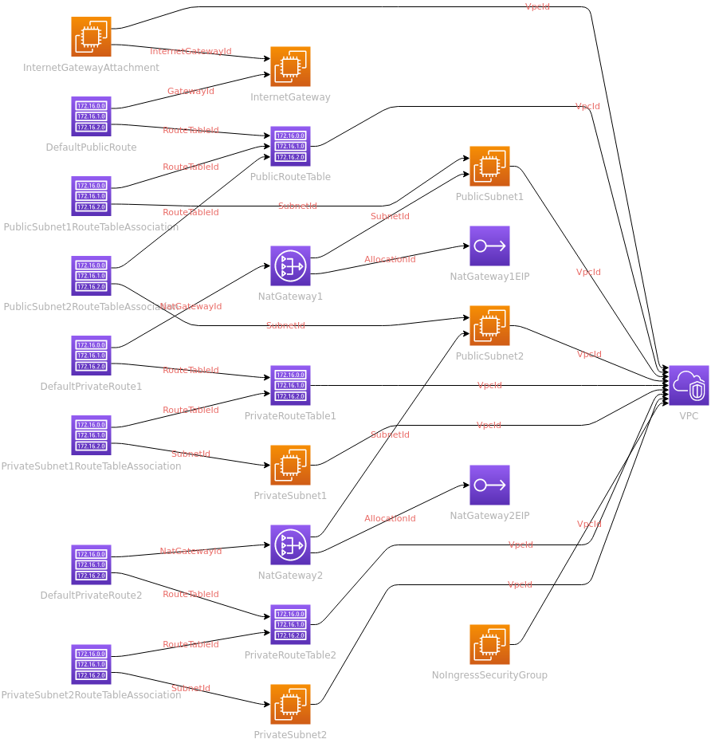
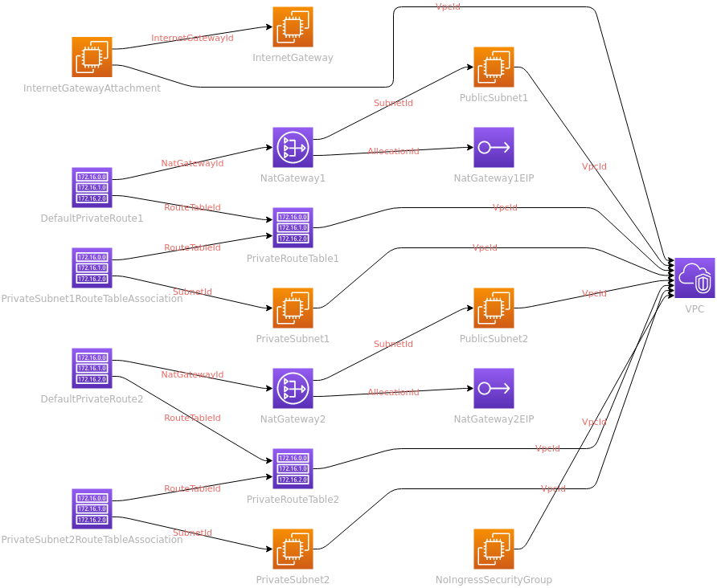

# aws-sceptre
Contains any base tooling required to run Sceptre, the Cloudformation wrangling tool

# Cloudformation VPC

2 types of VPC configuration are modelled in Cloudformation, an Application VPC and a more locked-down Security VPC. The `cfn-diagram` node package, along with the [draw-io-export action](https://github.com/marketplace/actions/draw-io-export-action) is used to document these as infrastructure diagrams.

### Application VPC

### Security VPC

